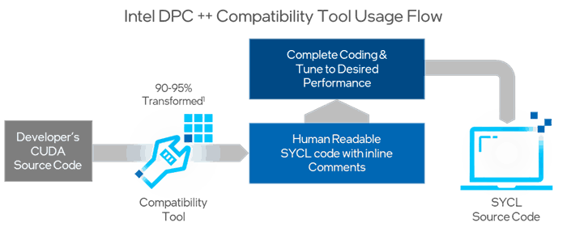
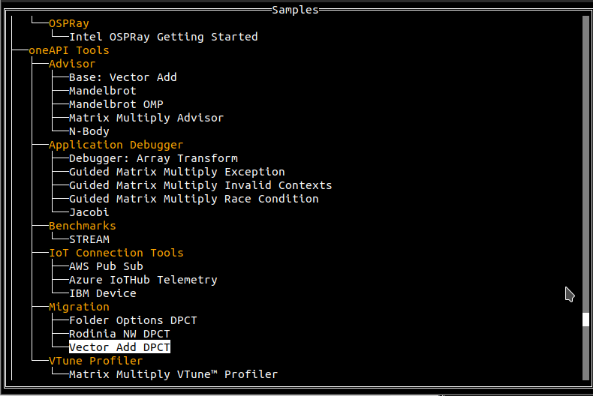
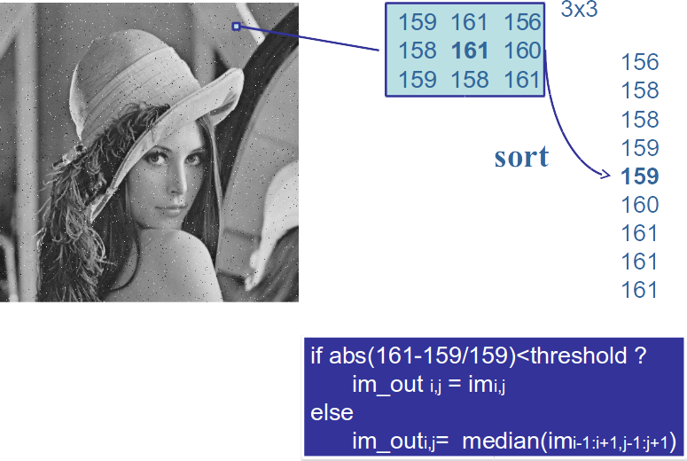

# Repository for the hands-on example on EuroPar24 Conference on Madrid

## Contents
* In this repository, you will find the codes proposed in the workshop [Intel-Danysoft oneAPI and HPC](https://www.danysoft.com/euro-par-2024/)
* To set up the workshop, it is recommended to follow the steps in the [Lab's Setup](#lab's-setup) section
* The codes we will work on are available in the [section "Examples"](#examples). Briefly, they cover some of the aspects shown in the theoretical part:
    * helloWorld: illustrates the selection of devices
    * vector add: sum of vectors
    * Migration of CUDA code to SYCL (vector sum)
* The description of the [Hands-on](#to-do) can be consulted at the end of this file
    * Image processing: salt & pepper noise reduction
    * Migration of CUDA code to SYCL (using the *cuBLAS* library)
    
    
# Lab's Setup
## Repository 
* It can be easily downloaded by cloning the repository using the command  ```git clone https://github.com/garsanca/oneAPI_IberianTour23```

## Slides
* All the material is available in the repository in the [Slides](Slides/)
   
   
## Intel Developer Cloud Account
* The [Intel® Developer Cloud](https://www.intel.com/content/www/us/en/developer/tools/devcloud/services.html) is a free development workspace for the developer community to program applications


**.... TODO ....**

# Examples

## helloWorld
1. In this [example](helloWorld/main.cpp) we are going to understand how a device is selected 
2. It selects the device we want to use **sycl::device**
    * The **kernel** is launched to an asynchronous *command-queue*

* The following table shows the devices types:

|   |   |
|---|---|
|**type**                 | **Device**                                                   |
| default\_selector_v     | Selects any device or host device if no device can be found  |
| gpu\_selector_v         | Select a GPU                                                 |
| accelerator\_selector_v | Select an accelerator                                        |
| cpu\_selector_v         | Select a CPU device                                          |
|*my\_device\_selector*   | *Custom selector*                                            | 


* The [source code](helloWorld/main.cpp) located in the directory [helloWorld](helloWorld/) shown the selection example, where
    * The line ```d = sycl::device(sycl::gpu_selector_v)``` selects the device
    * The class ```d.get_info``` return some features of the device
    * The ```single_task``` writes the output string "Hello, World!", which is associated to the execution on the **device selected**


```c
int main(int argc, char **argv) {

	auto d = sycl::device(sycl::default_selector_v);
	std::cout << "Using " << d.get_info<sycl::info::device::name>() << "\n";

	sycl::queue Q(d);

	Q.submit([&](handler &cgh) {
		// Create a output stream
		sycl::stream sout(1024, 256, cgh);
		// Submit a unique task, using a lambda
		cgh.single_task([=]() {
			sout << "Hello, World!" << sycl::endl;
		}); // End of the kernel function
	});   // End of the queue commands. The kernel is now submited

	// wait for all queue submissions to complete
	Q.wait();


  return 0;
}

```

* The compilation is done with the [Makefile](helloWorld/Makefile), writing **make** in the console and execution the **exec**
   * You can choose the device by modifying the value of the environmental variable  *ONEAPI_DEVICE_SELECTOR* to select the available devices shown with the command ```sycl-ls```

```bash
user@host:~/ $ make
icpx -c -o main.o main.cpp -I. -fsycl
icpx -o exec main.o -I. -fsycl  
user@host:~/ $ ls
exec  main.cpp  main.o  Makefile

user@host:~/ $ sycl-ls 
Warning: ONEAPI_DEVICE_SELECTOR environment variable is set to opencl:*;level_zero:1.
To see the correct device id, please unset ONEAPI_DEVICE_SELECTOR.
[opencl:acc:0] Intel(R) FPGA Emulation Platform for OpenCL(TM), Intel(R) FPGA Emulation Device 1.2 [2023.16.7.0.21_160000]
[opencl:cpu:1] Intel(R) OpenCL, Intel(R) Xeon(R) Platinum 8480+ 3.0 [2023.16.7.0.21_160000]
[opencl:gpu:2] Intel(R) OpenCL Graphics, Intel(R) Data Center GPU Max 1100 3.0 [23.22.26516.29]
[opencl:gpu:3] Intel(R) OpenCL Graphics, Intel(R) Data Center GPU Max 1100 3.0 [23.22.26516.29]
[opencl:gpu:4] Intel(R) OpenCL Graphics, Intel(R) Data Center GPU Max 1100 3.0 [23.22.26516.29]
[opencl:gpu:5] Intel(R) OpenCL Graphics, Intel(R) Data Center GPU Max 1100 3.0 [23.22.26516.29]
[ext_oneapi_level_zero:gpu:0] Intel(R) Level-Zero, Intel(R) Data Center GPU Max 1100 1.3 [1.3.26516]

user@host:~/ $ ONEAPI_DEVICE_SELECTOR=opencl:1 ./exec
Using Intel(R) Xeon(R) Platinum 8480+
Hello, World!
user@host:~/ $ ONEAPI_DEVICE_SELECTOR=opencl:2 ./exec
Using Intel(R) Data Center GPU Max 1100
Hello, World!
```

### ToDo
* You can experiment with the **selection** of devices such as CPU/GPU.


## Adding vector
* The next [example](vector_add/vector_add.cpp) illustrates the the vector adding vector $C_{i} = A_{i}+B_{i}$
    * Any user should complete the source code, in particular the lines marked with **TODO** 


```c
int *a; //TODO: create vectors with USM
int *b; //TODO: create vectors with USM
int *c; //TODO: create vectors with USM

// Parallel for
for(int i=0; i<N; i++){
	a[i] = i;   // Init a
	b[i] = i*i; // Init b
}


// Create a kernel to perform c=a+b
Q.submit([&](handler &h) { 
	/* To Do!!! */
}

for(int i=0; i<N; i++)
	std::cout << "c[" << i << "] = " << c[i] << std::endl;

free(a, Q);
free(b, Q);
free(c, Q);
```

### ToDo
1. Fill the memory allocation for the arrays *a*, *b* y *c* using the USM mechanism
2. Moreover, user should code the add vector kernel that is inside the region **Q.submit**

## CUDA to SYCL migration
* The example of the SYCL CUDA Migration program illustrates how to migrate code from CUDA vs SY Routine.
* The Tool DPCT (DPC++  Compatibility Tool) assists developers in migrating code written in [CUDA a DPC++](https://www.intel.com/content/www/us/en/developer/tools/oneapi/dpc-compatibility-tool.html), generating readable code whenever possible.
    * 90-95% of the code is automatically migrated
* Provides feedback to help developers complete the migration.
* More Information on DPCT:
    * Check [guide and reference guide](https://www.intel.com/content/www/us/en/docs/dpcpp-compatibility-tool/developer-guide-reference/2023-2/overview.html)
    * Visit the [Release Notes](https://software.intel.com/content/www/us/en/develop/articles/release-notes-for-intel-dpcpp-compatibility-tool.html) for the latest information

### Steps
1. Prepare the CUDA source for migration:
    * The DPCT/SYCLomatic compatibility tool searches for CUDA headers
2. Project migration: **execution of the compatibility tool**
    * For simple projects, migrate file by file
    * For complex projects (Microsoft Visual Studio project or Make/Cmake) is recommendable to build database
3. Review converted code:
    * Output files contain [annotations](https://software.intel.com/content/www/us/en/develop/documentation/intel-dpcpp-compatibility-tool-user-guide/top/diagnostics-reference.html) to assist in migrating any remaining code that could not be automatically migrated[^2]
4. Compilation with Intel® oneAPI DPC++/C++



### Software Requirements
* Installation of [SYCLomatic](https://github.com/oneapi-src/SYCLomatic) or use DPCT/SYCLomatic from the [Intel oneAPI Base Toolkit](https://www.intel.com/content/www/us/en/developer/tools/oneapi/base-toolkit.html#gs.0wmv37)
    * Prepare the environment with \texttt{source /opt/intel/oneapi/setvars.sh}
* CUDA headers are mandatory
    * /usr/local/cuda/include
    * /usr/local/cuda-x.y/include, where x.y must be some of the following versions: 8.0, 9.x, 10.1, 10.2, 11.0~11.8, 12.0


### Prepare the hands-on in the IDC
1. Download the CUDA headers with the command ```git clone --recursive https://gitlab.com/nvidia/headers/cuda.git```
2. Prepare the compacted headers in a single directory:
```bash
uXXXX@idc-beta-batch-head-node:~$ git clone --recursive https://gitlab.com/nvidia/headers/cuda.git
uXXXX@idc-beta-batch-head-node:~$ mkdir cuda-headers/
uXXXX@idc-beta-batch-head-node:~$ cp -r cuda/cudart/* cuda-headers/
uXXXX@idc-beta-batch-head-node:~$ cp -r cuda/curand/* cuda-headers/
uXXXX@idc-beta-batch-head-node:~$ cp -r cuda/nvcc/crt/ cuda-headers/
uXXXX@idc-beta-batch-head-node:~$ cp cuda/cublas/* cuda-headers/
```
### Example
* To illustrate the operation of the DPCT tool, we will use the example of vector addition that can be found in [GitHub](https://github.com/oneapi-src/oneAPI-samples/tree/master/Tools/Migration/vector-add-dpct)
    * O with the tool [oneapi-cli](https://www.intel.com/content/www/us/en/docs/oneapi-hpc-toolkit/get-started-guide-linux/2023-2/overview.html) which include many examples:
        1. "Create a project"
        2. "cpp"
        3. "oneAPI Tools->Migration->Vector Add DPCT"



* The CUDA source codes are located in the folder [DPCT-examples](DPCT-examples/vector-add-dpct/), so it is posssible to use the SYCLomatic tool
* Let's start to illustrate the migration of [a single CUDA source code](DPCT-examples/vector-add-dpct/src/vector_add.cu)
```bash
uXXXX@idc-beta-batch-pvc-node-04:~$ c2s --cuda-include-path=/home/uXXXX/cuda-headers/ --out-root=. vector-add-dpct/src/vector_add.cu
NOTE: Could not auto-detect compilation database for file 'vector_add.cu' in '/home/uXXXX/vector-add-dpct/src' or any parent directory.
Parsing: /home/uXXXX/vector-add-dpct/src/vector_add.cu
Analyzing: /home/uXXXX/vector-add-dpct/src/vector_add.cu
Migrating: /home/uXXXX/vector-add-dpct/src/vector_add.cu
Processed 1 file(s) in -in-root folder "/home/uXXXX/vector-add-dpct/src"

See Diagnostics Reference to resolve warnings and complete the migration:
https://software.intel.com/content/www/us/en/develop/documentation/intel-dpcpp-compatibility-tool-user-guide/top/diagnostics-reference.html

```
* Some **warnings** commes from the different API among CUDA and SYCL. More info can be found in the [**diagnosis**](https://software.intel.com/content/www/us/en/develop/documentation/intel-dpcpp-compatibility-tool-user-guide/top/diagnostics-reference.html) reference that shows the correspondence of the warnings codes

* Now, We are now able to compile the code generated with the **icpx** compiler and run it:

```bash
uXXXX@idc-beta-batch-pvc-node-04:~$  icpx -o vector vector_add.dp.cpp -fsycl
uXXXX@idc-beta-batch-pvc-node-04:~$  ./vector

  2   4   6   8  10  12  14  16  18  20  22  24  26  28  30  32 
 34  36  38  40  42  44  46  48  50  52  54  56  58  60  62  64 
 66  68  70  72  74  76  78  80  82  84  86  88  90  92  94  96 
 98 100 102 104 106 108 110 112 114 116 118 120 122 124 126 128 
130 132 134 136 138 140 142 144 146 148 150 152 154 156 158 160 
162 164 166 168 170 172 174 176 178 180 182 184 186 188 190 192 
194 196 198 200 202 204 206 208 210 212 214 216 218 220 222 224 
226 228 230 232 234 236 238 240 242 244 246 248 250 252 254 256 
258 260 262 264 266 268 270 272 274 276 278 280 282 284 286 288 
290 292 294 296 298 300 302 304 306 308 310 312 314 316 318 320 
322 324 326 328 330 332 334 336 338 340 342 344 346 348 350 352 
354 356 358 360 362 364 366 368 370 372 374 376 378 380 382 384 
386 388 390 392 394 396 398 400 402 404 406 408 410 412 414 416 
418 420 422 424 426 428 430 432 434 436 438 440 442 444 446 448 
450 452 454 456 458 460 462 464 466 468 470 472 474 476 478 480 
482 484 486 488 490 492 494 496 498 500 502 504 506 508 510 512 

```

## Training and inference with optimazed PyTorch
* Intel boosts performance on CPUs and GPUs through the Extension
* Open-source code available on GitHub
    * [CPU](https://github.com/intel/intel-extension-for-pytorch/tree/cpu-master): Code and [documentation](https://intel.github.io/intel-extension-for-pytorch/cpu/latest/)
    * [GPU](https://github.com/intel/intel-extension-for-pytorch/tree/xpu-master): Code and [documentation](https://intel.github.io/intel-extension-for-pytorch/xpu/latest/)


* The [jupyter notebook](ipex/IntelPyTorch_GPU_InferenceOptimization_with_AMP/IntelPyTorch_GPU_InferenceOptimization_with_AMP.ipynb) shows an exmaple of the [ResNet50](https://pytorch.org/vision/main/models/generated/torchvision.models.resnet50.html) training code in PyTorch, being able to perform the training in different devices: CPU, CPU (AMX), GPU(FP32/BF16)
     * It evaluates the performance and the precision used in the model
     * NOTE: to be performed in the Intel Developer Cloud the **pytorch-gpu** environment should be pre-selected

# To-Do
## Image processing
* The following example shows the processing of **noise reduction in a image (salt and pepper)**


* To achieve this, a median filter is used into a 3x3 pixel neighborhood:
    * Given a pixel at the position (i, j), its value will be ```im[i][j]```
    1. The neighbors of the pixel (i, j) are temporarily stored
    2. To achieve the **median value**, the pixels of 3x3 neighborhood are sorted: **sort**
    3. The **median** correspond to the middle element of the sorting
        * If a threshold is not exceeded, the output pixel is equivalent to the input pixel
        * Otherwise, the resulting pixel would be the median value.



* Compile: using the [*make*](image_salt_pepper/Makefile)
* Execution: **host** and **device** execution could be control with the last input in the execution command
     * host: ```./main LennaSALTPEPPER.bmp output.bmp h```
     * device: ```./main LennaSALTPEPPER.bmp output.bmp g```

### ToDo
* The kernel to be developed can be found at [**kernels.cpp**](image_salt_pepper/kernels.cpp) file
     * It takes as input the queue *Q*, the input image *im*, the threshold value *threshold*, and the *height* and *width* of the image height, width
     * The output image is written to **image_out**
     * The queue selection is done in the file [**main.cpp**](image_salt_pepper/main.cpp), and memory for the input and output images is allocated using the USM mechanism

## Advanced CUDA to SYCL Code Migration (Libraries)
* The example has been extracted from the [oneAPI-samples](https://github.com/oneapi-src/oneAPI-samples/tree/master/DirectProgramming/C%2B%2BSYCL/DenseLinearAlgebra/guided_matrix_mul_SYCLMigration) which explores the use of SYCLomatic with linear algebra libraries such as cuBLAS
* For this purpose, we will use the matrix multiplication example employing the **matrixMulCUBLAS** available in [CUDA examples](https://github.com/NVIDIA/cuda-samples/tree/master/Samples/4_CUDA_Libraries/matrixMulCUBLAS)

### Example setup
1. Download the example from [GitHub](https://github.com/NVIDIA/cuda-samples/tree/master/Samples/4_CUDA_Libraries/matrixMulCUBLAS) ```git clone https://github.com/NVIDIA/cuda-samples.git```
2. Invoke the **Intercerpt-build tool**: ```intercept-build make``` which generates a JSON file with all the source files involved in the project
3. Invoke the migration tool **DPCT** or **SYCLomatic**: ```dpct -p compile_commands.json``` or ```c2s -p compile_commands.json```
4. Review the diagnostic messages
5. Compile the "migrated" file, considering that the call to **cublasSgemm** is now translated by the function  **oneapi::mkl::blas::column_major::gemm** from the [oneMKL](https://www.intel.com/content/www/us/en/docs/oneapi/programming-guide/2023-0/intel-oneapi-math-kernel-library-onemkl.html)
    * To compile the generated code, you need to add the compilation flags for oneMKL, which can be found in the ["link-advisor"](https://www.intel.com/content/www/us/en/developer/tools/oneapi/onemkl-link-line-advisor.html) tool
    * NOTE: Comment out lines 91-96 requesting knowledge of the device, as this is specific to the CUDA API

```bash
uXXXX@idc-beta-batch-pvc-node-04:~$  git clone https://github.com/NVIDIA/cuda-samples.git
uXXXX@idc-beta-batch-pvc-node-04:~$  cd cuda-samples/Samples/4_CUDA_Libraries/simpleCUBLAS
uXXXX@idc-beta-batch-pvc-node-04:~/cuda-samples/Samples/4_CUDA_Libraries/simpleCUBLAS$ intercept-build make
uXXXX@idc-beta-batch-pvc-node-04:~/cuda-samples/Samples/4_CUDA_Libraries/simpleCUBLAS$ c2s --cuda-include-path=/home/uXXXX/cuda-headers/  -p compile_commands.json
uXXXX@idc-beta-batch-pvc-node-04:~/cuda-samples/Samples/4_CUDA_Libraries/simpleCUBLAS$ icpx -o simpleCUBLAS dpct_output/simpleCUBLAS.cpp.dp.cpp -fsycl  -L${MKLROOT}/lib/intel64 -lsycl -lOpenCL -lpthread -lm -ldl -DMKL_ILP64  -qmkl=parallel  -I../../../Common/
```

